<p align="center">
  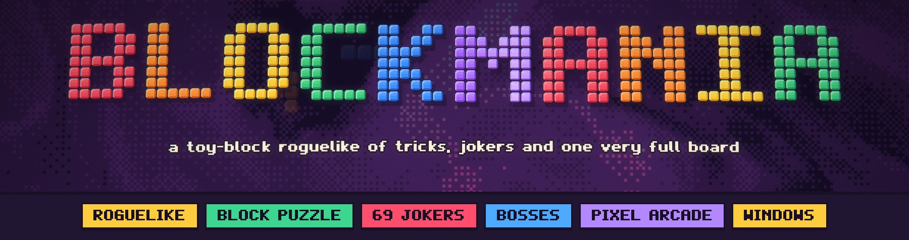
</p>

<p align="center">
  
  
  
  
  
</p>

<p align="center">
  <b>Place blocks. Clear lines. Break the machine.</b><br>
  A single-player roguelike where an 8×8 block puzzle meets a deck of rule-bending Jokers,<br>
  escalating bosses and a scoring engine that can reach a quadrillion points.
</p>

<h2 align="center">⬇ Download and play</h2>

<p align="center">
  <a href="https://github.com/ElMariones/blockmania/releases/latest/download/BLOCKMANIA-Windows.zip"></a>
  <a href="https://github.com/ElMariones/blockmania/releases/latest/download/BLOCKMANIA-macOS.zip"></a>
  <a href="https://github.com/ElMariones/blockmania/releases/latest/download/BLOCKMANIA-Linux.zip"></a>
</p>

<p align="center">
  Free, no install, no account. Unzip and play.<br>
  <b>Windows:</b> double-click <code>BLOCKMANIA.exe</code> (if SmartScreen appears: <i>More info → Run anyway</i>).<br>
  <b>Mac:</b> drag <code>BLOCKMANIA.app</code> to Applications, then <i>right-click → Open</i> the first time.<br>
  <b>Linux:</b> run <code>BLOCKMANIA.x86_64</code>.<br>
  <sub>In-development build · not code-signed yet · all versions on the <a href="https://github.com/ElMariones/blockmania/releases">Releases page</a></sub>
</p>

<p align="center">
  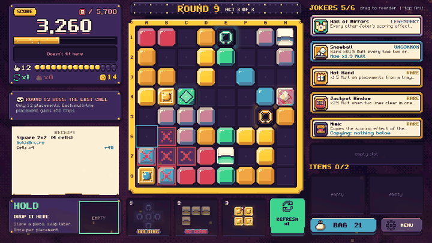
</p>

<p align="center">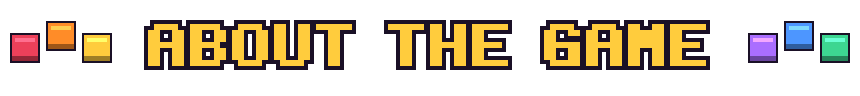</p>

**BLOCKMANIA** starts as the block puzzle everyone knows: three pieces in your tray, an 8×8 board, fill a row or a column and it clears. Then it gets out of hand.

Every piece comes from **your own bag**, and you can upgrade it: chrome that pays Chips, neon that adds Mult, gold that prints Credits, glass that shatters for a multiplier. Between rounds the **Toybox** sells **Jokers**, 69 rule-bending cards. They grow with every clear, copy their neighbours, pay you for patience or double everything the others do. Each placement is scored as **Chips × Mult**, and every number is itemized on a receipt so you always know why a move was worth 12 points or 12 million.

Twelve rounds, three acts, and a boss at the end of each act that rewrites one rule. Beat round 12 and the machine offers **Overtime**: targets explode, bosses return as **Mk II**, and the only way out is losing, or scoring one quadrillion points in a single placement and **breaking the machine**.

<p align="center">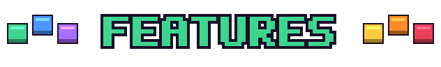</p>

<table>
<tr>
<td width="55%">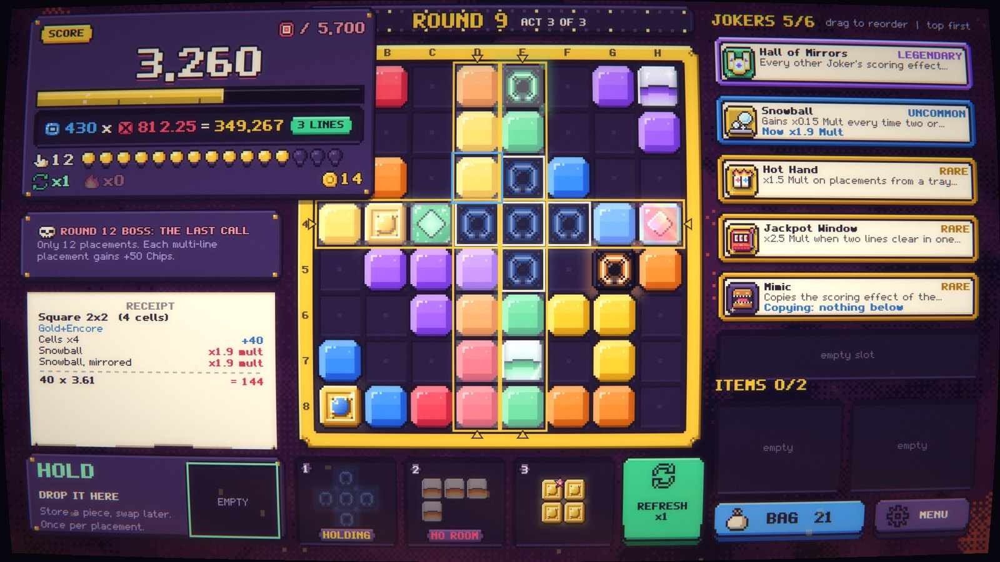</td>
<td>
<h3>A puzzle you read at a glance</h3>
<p>Carry a piece and the board shows exactly where it fits, which lines it completes and what it will score (<b>Chips × Mult = points</b>), before you commit. No hidden rolls, no timers: every result is decided by the rules and only <i>shown</i> by the effects.</p>
</td>
</tr>
<tr>
<td>
<h3>69 Jokers, 4 of them Legendary</h3>
<p>Chips, Mult and ×Mult cards, economy cards, cards that grow for the whole run, and cards that copy the one next to them. Order matters. The four <b>Legendaries</b> change how the game plays: <b>The Avalanche</b> adds gravity and chain waves, <b>Hall of Mirrors</b> makes every Joker trigger twice, <b>Philosopher's Stone</b> turns your bag to metal, <b>Supernova</b> builds each round to a crescendo.</p>
</td>
<td width="55%">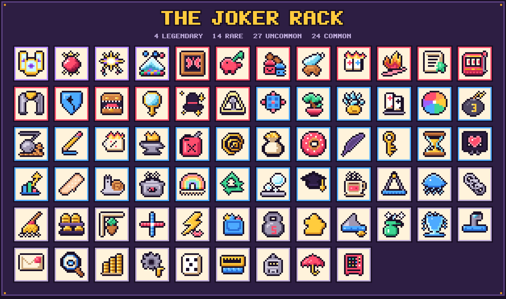</td>
</tr>
<tr>
<td width="55%">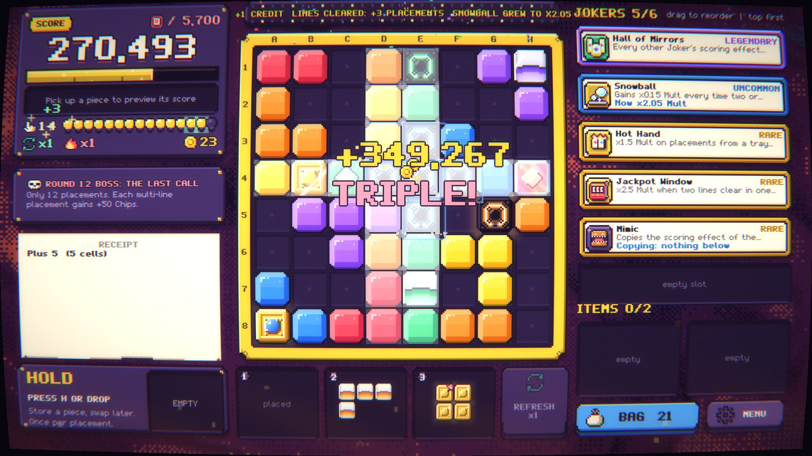</td>
<td>
<h3>Big, loud, readable payoffs</h3>
<p>Lines flash, blocks burst in the style of their finish, Jokers fire one by one in scoring order with their own sound, the score rolls up a tube, and feats like <b>Crossfire</b> and <b>Hat Trick</b> get their own medals. A CRT filter, a living shader background and a capped particle system give it the arcade glow. Reduced Motion keeps every number.</p>
</td>
</tr>
<tr>
<td>
<h3>Bosses with an entrance</h3>
<p>Each act ends with a boss that bends one rule: fixed blocks, a tax on your first line, barred tray slots, a tombstone every third move. From act 2 they come back as <b>Mk II</b>, with a warning cinematic, a hazard-tape frame around the screen, chase lights on the board and their own music.</p>
</td>
<td width="55%">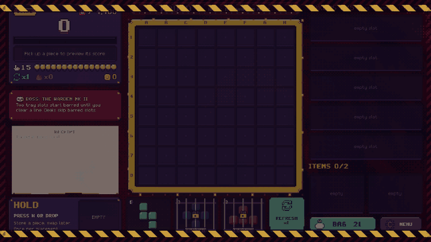</td>
</tr>
<tr>
<td width="55%">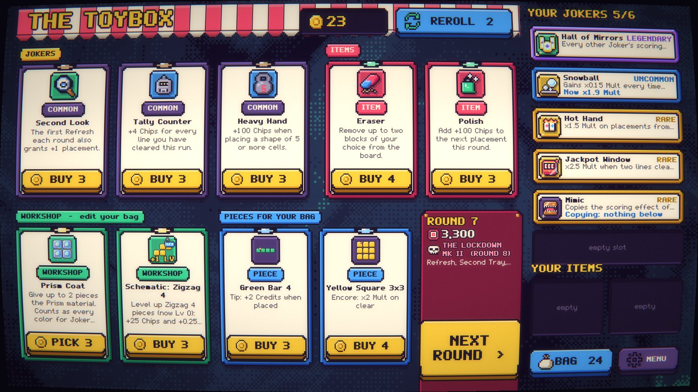</td>
<td>
<h3>Build your bag, not just your deck</h3>
<p>The Toybox sells Jokers and one-use items (a throwable brick, an eraser, a second tray), plus <b>Workshop</b> upgrades that edit the pieces themselves: repaint, rotate, copy, remove, add materials and stamps. Save your Credits and earn interest, or overkill a target for a bonus.</p>
</td>
</tr>
<tr>
<td>
<h3>Choose how hard the next round is</h3>
<p>Before each normal round, pick <b>Standard</b> or a twist: <i>Double or Nothing</i> (target ×1.4 for +6 Credits), <i>Gold Rush</i>, <i>Rush Hour</i>, <i>Mult Fever</i>, <i>Treasure Hunt</i>... Keep one piece in reserve with <b>Hold</b>, and read your bag's odds before you commit.</p>
</td>
<td width="55%">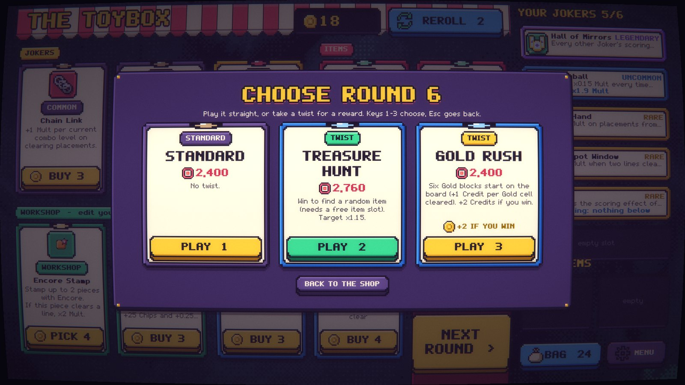</td>
</tr>
<tr>
<td width="55%">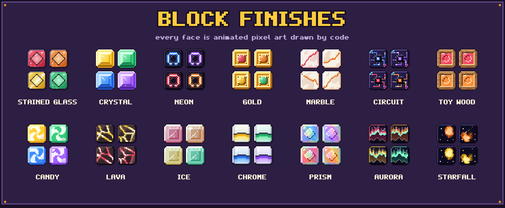</td>
<td>
<h3>Blocks with character</h3>
<p>Materials and Endless styles share one catalog of animated finishes: light rolls through stained glass, neon tubes flicker, lava pulses, stars fall. Each has its own glow, particles and place/clear sounds, and a calm rest pose for Reduced Motion.</p>
</td>
</tr>
</table>

<p align="center">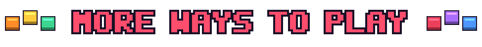</p>

- **Five Kits.** Different starter bags and rules (Standard, Compact, High Roller, Chunky, Tetromino), unlocked by playing.
- **Heat 0–5.** Win a run to unlock the next stake: bigger targets, fewer placements, capped interest, every boss Mk II.
- **Daily run.** One seed per day, the same pieces, shops and bosses for everyone. Local, no account.
- **Overtime.** Keep playing after the final boss, with milestone moments at one million, one billion and one trillion points in a single placement.
- **Endless.** A relaxed arcade mode with a ×10 combo ladder, Hold, 15 block styles, a local top ten and a score graph for every game.
- **60 achievements** on five pages, ten of them secret. Some unlock new Jokers.
- **Eleven languages.** English, Español, Français, Italiano, Deutsch, Nederlands, Polski, Português (BR), 日本語, 简体中文 and 繁體中文. The game follows your Steam language and switches any time from the options.
- **POPS**, the arcade's old caretaker bot, shows first-time players around: he pops up in the corners, points at things and chatters in toy gibberish. Skip him any time.

<p align="center">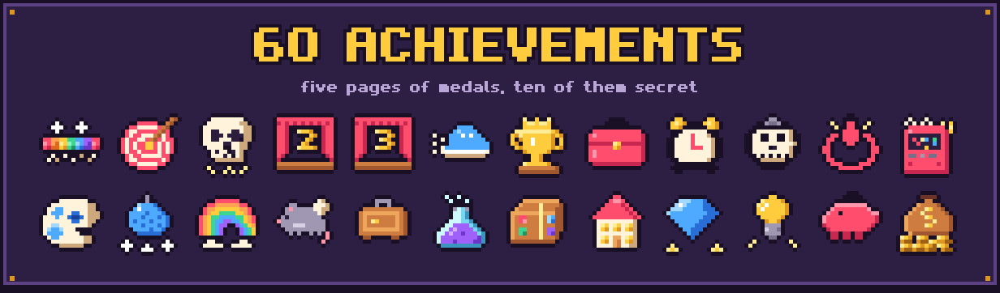</p>

<p align="center">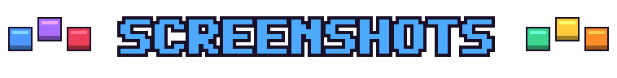</p>

| | |
|:---:|:---:|
| 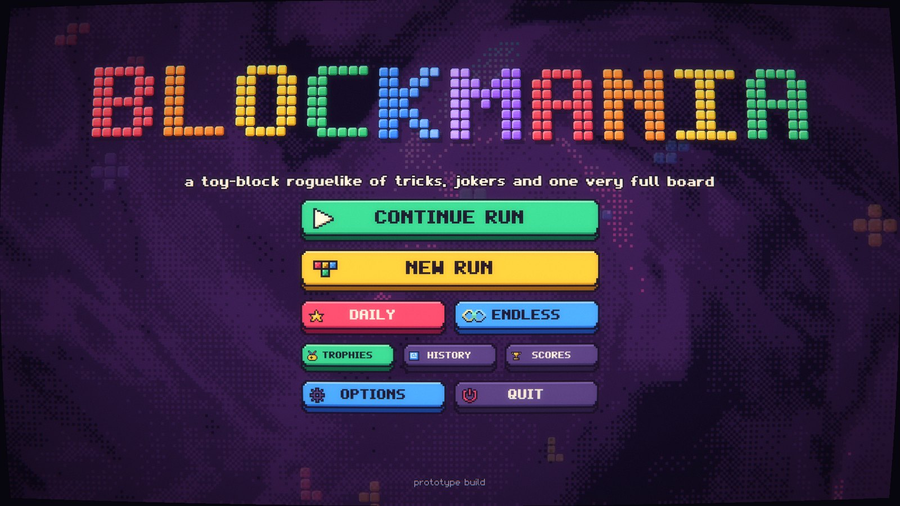 | 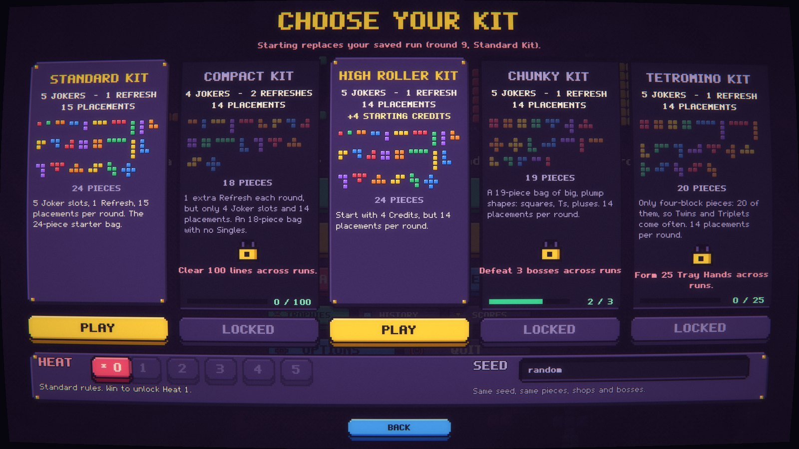 |
| **Title**: the logo is made of blocks, and you can knock the letters out | **Kits and Heat**: pick a starter bag and a stake |
| 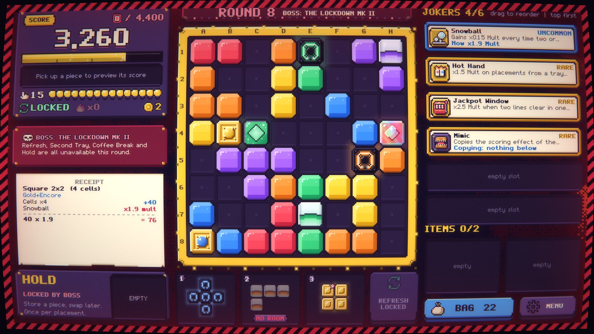 | 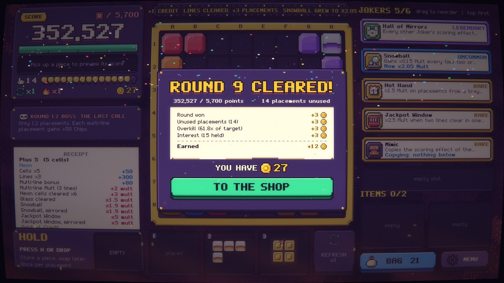 |
| **Boss round**: The Lockdown Mk II locks Refresh and Hold | **Round won**: every Credit itemized |
| 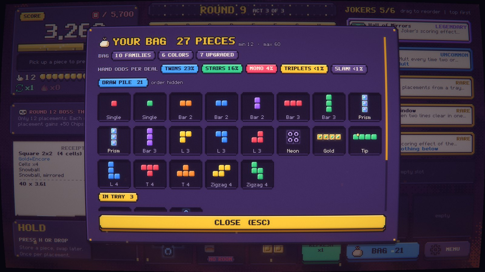 | 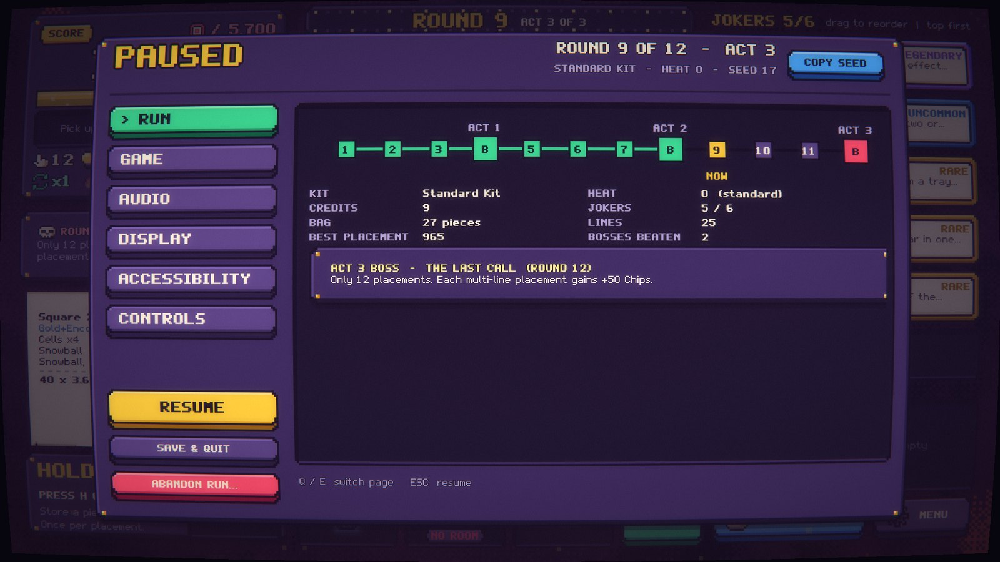 |
| **Your bag**: every piece, and the odds of the next deal | **Pause**: the run at a glance, and tabbed settings |
| 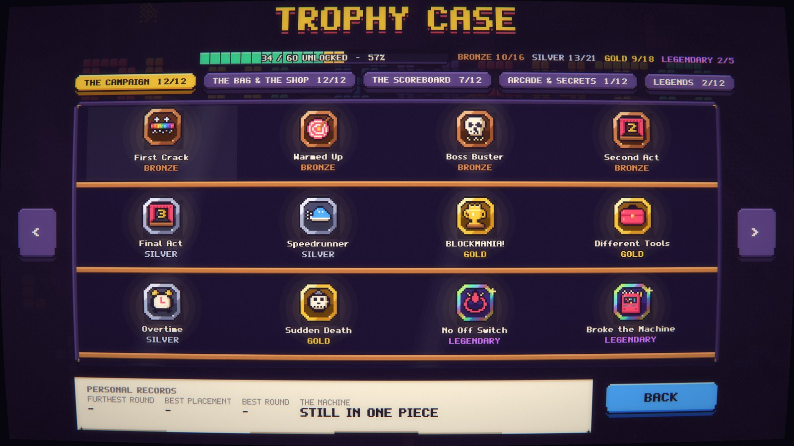 | 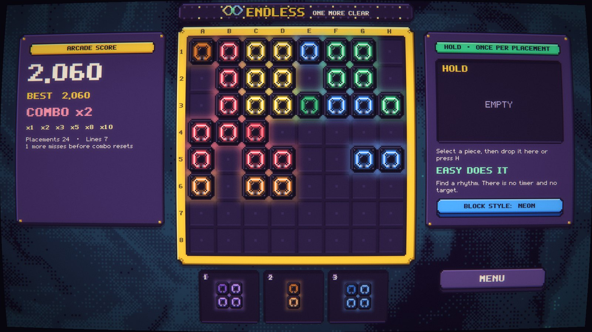 |
| **Trophy Case**: medals by tier and personal records | **Endless**: combo ladder, Hold and 15 block styles |

<p align="center">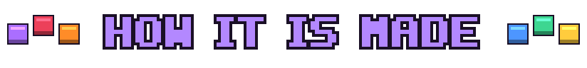</p>

Everything you see and hear is **authored as code** in this repository, with no stock assets and no image-generator art:

- **Pixel art from Python.** The UI kit, 9-slice frames, 69 Joker and item portraits, achievement icons, 14 animated block finishes and the app icon are drawn by Pillow scripts in [`tools/art/`](tools/art) and regenerated on demand.
- **An original pixel font.** *Blockhead* regular and bold are built glyph by glyph with fontTools ([`gen_font.py`](tools/art/gen_font.py)).
- **Localized pixel type.** Blockhead carries the accents of seven Latin languages; Japanese and Chinese fall back to Fusion Pixel subsets (OFL) tuned to the same 10-pixel grid. A layout scenario walks every screen in every language ([docs/localization.md](docs/localization.md)).
- **Synthesized audio.** About 140 sound effects and 13 music tracks are synthesized with NumPy/SciPy DSP (oscillators, envelopes, filters, drum and pad voices, arrangement data) in [`tools/audio/`](tools/audio). Provenance is in the [audio manifest](assets/audio/AUDIO_MANIFEST.md).
- **Shaders.** A domain-warped swirl background with per-mood palettes, a CRT pass (curvature, scanlines, chromatic aberration, bloom; mouse input is remapped through the same warp) and an edge-only mood layer (hazard tape, danger vignette, heat haze), all in Godot shading language ([`game/presentation/shaders/`](game/presentation/shaders)).
- **These README images** come from the game itself. [`tools/readme/`](tools/readme) replays a seeded run in an off-screen window, captures frames in slow motion for the GIFs, and composes the banner and galleries from the game's own art.

<p align="center">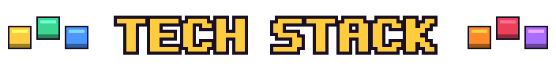</p>

| Area | Stack |
|---|---|
| Engine | **Godot 4.7.2** (Forward+), pinned version, main scene `game/main.tscn` |
| Language | **GDScript** with static typing, about 16k lines of game code, 3k of tests and 9k of tooling |
| UI | Built entirely in code on a fixed 1920×1080 stage centered for any aspect ratio (verified at 720p, 16:10 and ultrawide); custom theme, 9-slice kit, keyboard focus model |
| Rendering | Godot shading language (3 shaders), a capped CPU particle layer, procedural block painter with animated sprite-sheet finishes |
| Audio | Two buses (music and SFX), a pooled player with rate limits, playlists per game context, runtime-synthesized combo percussion |
| Tooling | Python 3 · Pillow · fontTools · NumPy · SciPy · SoundFile |
| Testing | **End-to-end suite** (`tests/e2e/`) that plays the real game through its UI (campaign, Endless, menus, tutorial) and writes repeatable JSON artifacts plus screenshots; 195 isolated rule tests kept only where they catch what E2E cannot |
| Simulation | Autoplayer bot, paired-seed content experiments and a persona playtest harness (15 simulated player types, 770+ runs per report) |
| Build | Windows export preset: a single self-contained `.exe` with embedded pack, icon and version info |
| Workflow | Git, design-doc-driven development ([GDD](GAME_DESIGN_DOCUMENT.md), [TASKS](TASKS.md), [ASSET_PLAN](ASSET_PLAN.md)) and an [AGENTS.md](AGENTS.md) contract for AI-assisted pair programming |

<p align="center">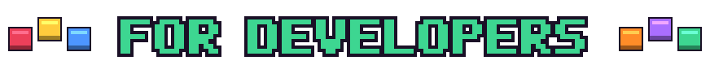</p>

### Architecture

```
game/
├── rules/          Pure rules, no nodes: board, bag (draw/discard piles), placement resolver,
│                   Tray Hands, seeded RNG streams, Endless rules
├── content/        Data catalogs with stable IDs: shapes, pieces, Jokers, items, Workshop tools,
│                   bosses, round cards, Kits and targets, feats, achievements, tips
├── run/            BMRun: complete run state + every player command, history, replay, save schema;
│                   save / settings / profile / history / achievement stores
├── ui/             Screens and widgets built in code (game, shop, title, settings, trophy case...)
├── presentation/   Visual-only: block painter, finishes, card art, swirl + CRT + mood shaders, FX
└── main.gd         App root: routing, the single act() entry point, autosave, pause, input map
```

- **Rules before spectacle.** Every player action is one atomic command on `BMRun` that returns a resolution record. The UI calls a single entry point (`BMMain.act`) and only *reads* records: animations, particles and shaders can never change a score, and skipping them changes nothing.
- **Preview equals result by construction.** The score preview runs the real placement pipeline on a clone of the run.
- **Deterministic and replayable.** Separate seeded streams for shapes, shop and bosses, stored as strings to survive JSON. A seed plus the action history replays a run exactly, and tests check it across save/resume.
- **Versioned saves.** Autosave after every action with an atomic temp-file-and-rename, schema version 7 with migrations, settings kept apart from run state.
- **Data-driven content.** Jokers, bosses, items and achievements are catalog entries with stable IDs; card text is tested against behavior, and every Joker has a trigger and a no-trigger test.
- **Accessible by default.** Keyboard play on every screen, focus outlines only after keyboard input, block patterns so colors never carry meaning alone, Reduced Motion, and separate shake, flash and screen-effect strengths.

### Balancing with bots

Numbers are tuned with evidence, not guesswork. [`tools/autoplayer.gd`](tools/autoplayer.gd) plays full runs from the score preview; [`tools/experiments.gd`](tools/experiments.gd) compares content on paired seeds; [`tools/playtest.gd`](tools/playtest.gd) simulates 15 personas, from a random clicker to a whole-tray planner and seven build archetypes. Reports live in [`docs/balance/`](docs/balance) and [`docs/playtests/`](docs/playtests), and every provisional number in the design doc points to one.

### Release builds

`tools/release/build_release.sh` exports the three downloadable zips (Windows x86_64, macOS universal with ad-hoc signing, Linux x86_64) into `build/release/`; `tools/release/install_templates.sh` fetches the Godot 4.7.2 export templates first. Bumping `tools/release/VERSION` on `main` (or pushing a tag such as `v0.1.1`) runs `.github/workflows/release.yml`, which does the same on GitHub Actions and publishes a Release with fixed asset names, so the download buttons above always point at the newest build.

### Run it

Open the folder in **Godot 4.7.2** and press Play, or use the command line (`godot` is your Godot 4.7.2 executable):

```bash
godot --headless --path . --import                                    # first run / after adding scripts
godot --path .                                                        # play
godot --headless --path . --script res://tests/e2e/run_e2e.gd        # E2E suite; artifacts in build/e2e/
godot --headless --path . --script res://tests/run_tests.gd           # isolated rule tests (exit code 0 = pass)
godot --headless --path . --script res://tests/run_tests.gd -- jokers # one suite
godot --headless --path . --script res://tools/simulate.gd -- 200 1   # bot balance probe
godot --headless --path . --script res://tools/playtest.gd -- planner 60 1001 /tmp/planner.json
python tools/shoot.py fixture.gd out.png 1920x1080                    # screenshot without the editor
python tools/readme/shoot_all.py && python tools/readme/build_media.py  # rebuild these README images
tools/release/build_release.sh                                          # Windows, macOS and Linux zips in build/release/
```

Regenerating art or audio: `python tools/art/gen_ui.py`, `gen_cards.py`, `gen_finishes.py`, `gen_font.py`, and `python tools/audio/gen_sfx.py`, `gen_music.py` (see [AGENTS.md](AGENTS.md) for the full list). Windows exports need the official Godot 4.7.2 export templates.

**Controls:** drag a piece onto the board, or click it and then a cell (right-click or Esc to cancel). Keyboard: `1`–`3` pick a piece, arrows/WASD move it, Enter/Space place, `H` hold, `R` refresh, `B` bag, `M` sound, Esc pause. In menus, Q/E switch pages. Drag Jokers to reorder them (Alt+Up/Down with the keyboard).

### Documentation

| Document | What is in it |
|---|---|
| [GAME_DESIGN_DOCUMENT.md](GAME_DESIGN_DOCUMENT.md) | Every mechanic, formula and content item, precise enough to reimplement; §15 lists rule interpretations |
| [TASKS.md](TASKS.md) | Live backlog, milestones, balance watch with simulation results, open decisions |
| [ASSET_PLAN.md](ASSET_PLAN.md) | Every visual and audio deliverable with source and status |
| [AGENTS.md](AGENTS.md) | Architecture rules, conventions and commands for contributors and coding agents |
| [THIRD_PARTY.md](THIRD_PARTY.md) | Dependencies and licenses (the engine, plus one dev-only editor plugin) |

<p align="center">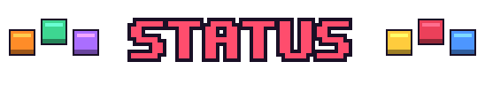</p>

BLOCKMANIA is **in development** for Windows, with Steam as the planned storefront. A full 12-round run, Overtime, Endless, the Daily run, achievements and all the content above are playable today; balance numbers are provisional until human playtests. Next up: a scripted tutorial round, UI scaling and input remapping, colorblind presets, a collection view, and performance profiling on target hardware.

**Author:** Mario Landáburu ([@ElMariones](https://github.com/ElMariones)): design, code, art and audio tooling.
All game code, art, fonts and audio are original works made for this project (see [THIRD_PARTY.md](THIRD_PARTY.md)). No license file is included yet, so default copyright applies.
